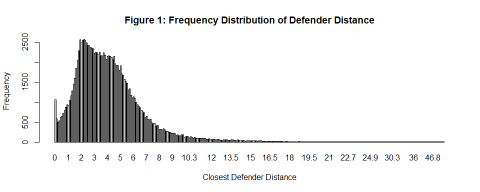
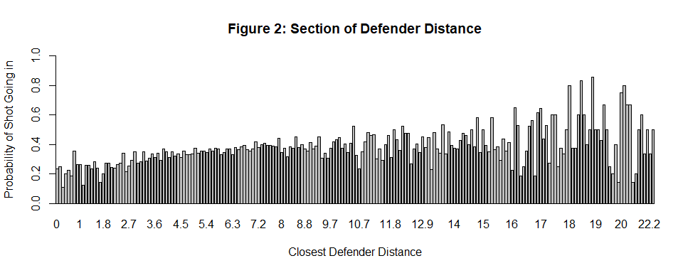
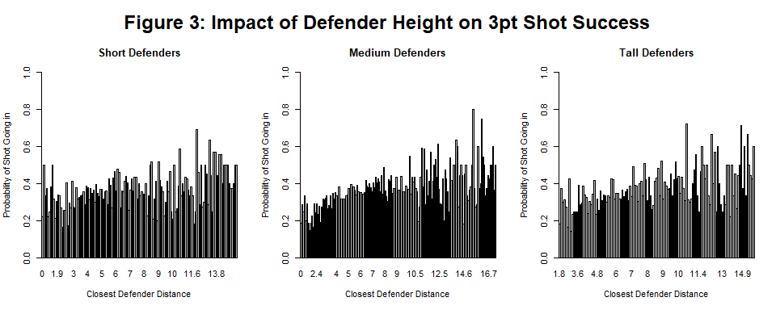
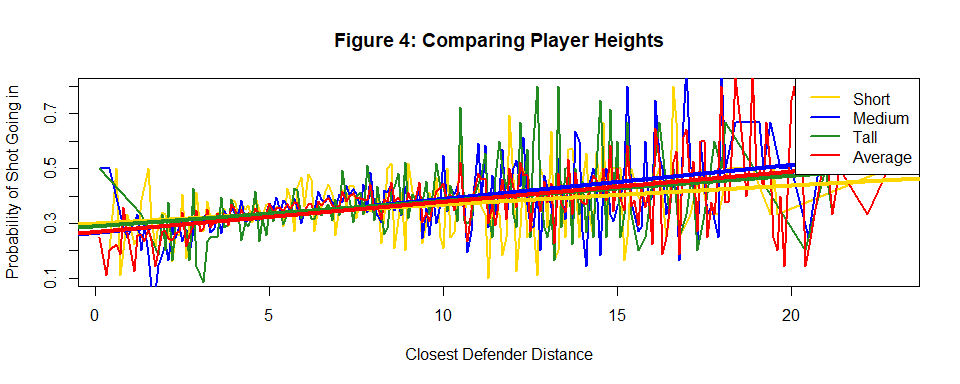
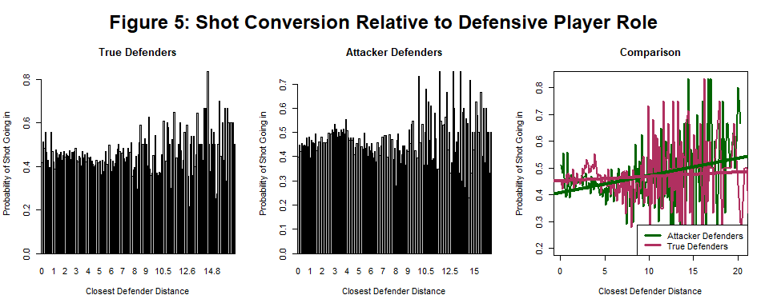
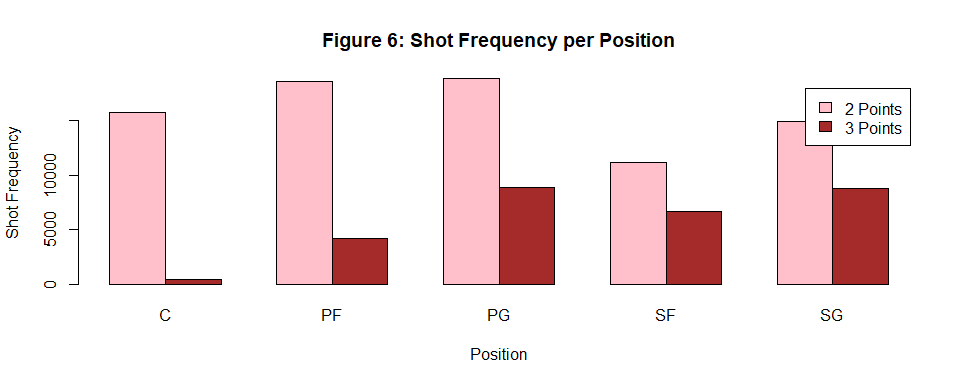
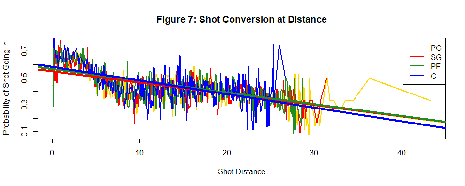
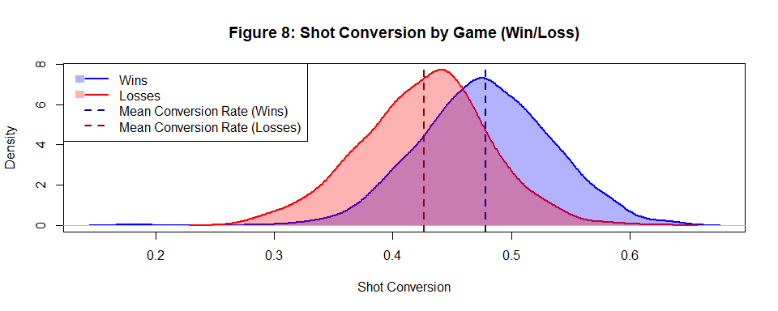
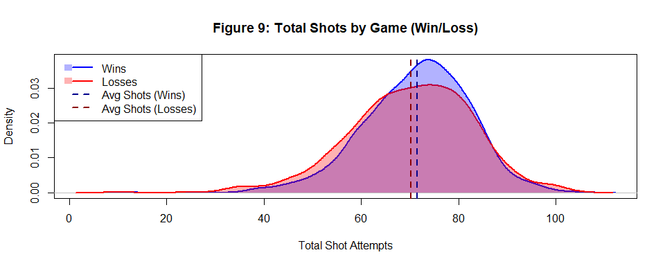
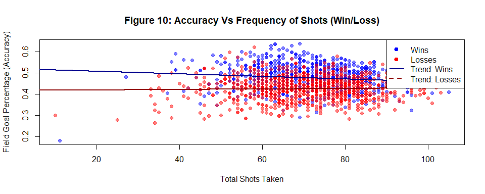

Analysis of Factors Affecting Shots in the NBA
================

## Group :

Llewellyn Curtis\
Henry Earl\
Vaughan Boniface\
Henry Edgington\
Fintan Pawley\
Scott Airey

## Abstract:

This report examines the factors influencing shot success in the NBA,
with a primary focus on the spatial relationship between shooters and
defenders. Utilizing player tracking data, we analyze the frequency
distribution of defender proximity and its impact on shot conversion. We
then also look broadly at the nature of shooting in the NBA and whether
shot accuracy or frequency play a bigger role in the game outcome.

## Section 1: Proximity of Defenders

This analysis explores the dynamics of shot success, specifically
focusing on the distance relationship between shooters and defenders.
While intuition suggests that a tighter gap between players would lead
to lower shot percentages, we can look a bit deeper at nature of the
defensive player to observe trends.

### Defender Distance

The section begins by mapping the frequency distribution of defender
distances to understand the typical shooting senarios we can then look
into. Figure 1 visualizes the frequency distribution of the closest
defender, illustrating how many shot attempts occur at specific
distances, in metres, from the nearest defender.

<!-- -->

The plot shows that the data is heavily left-skewed, with a distinct
peak occurring between roughly 2 and 6 feet. This indicates that the
vast majority of NBA shots are contested within a relatively tight
window, reflecting the high level of defensive pressure. Beyond 10 feet,
the frequency drops off significantly, representing “wide open”
scenarios or transition plays where the defender has been beaten or lost
in rotation. Notably, the presence of data points extending as far as
40+ feet highlights the “messy” nature of raw NBA data. This
distribution serves as the baseline for our analysis, allowing us to
identify the primary clusters of play before filtering out these extreme
outliers to find a more accurate correlation between proximity and shot
success.

### Shot Conversion

This bar plot visualizes the relationship between the distance of the
closest defender and the probability of a shot being successful. It
represents a refined iteration of the previous dataset, specifically
filtered to exclude low-frequency outliers, to provide a less volatile
trend of how defensive proximity impacts shot conversion.

<!-- -->

The bar plot reveals a clear upward trend in scoring probability as the
distance of the closest defender increases, particularly within the 0 to
10-foot range. While the likelihood of a successful shot generally
improves with more space, the data becomes significantly more volatile
beyond 15 feet. Even after removing low-frequency occurrences to clean
the “messy” numbers, the erratic spikes at greater distances suggest
that these wide-open scenarios are less common, causing individual makes
or misses to have a disproportionate impact on the calculated
probability. Ultimately, the graph demonstrates that while increased
distance generally aids the shooter, the relationship is most consistent
when defenders are in closer proximity.

### Player Heights

Building on the previous findings, this section examines whether the
physical stature of the nearest Defender influences shooting conversion.
Defenders will be categorized into short, medium, and tall groups based
on height quartiles. By comparing these specific subgroups against the
general trends identified earlier, we can determine if a defender’s
height acts as a multiplier that offsets the advantage of offensive
space.

<!-- -->

Upon reviewing the individual distributions for “Short,” “Medium,” and
“Tall” players in figure 3, it is evident that all three groups exhibit
a broadly similar trend: shot probability scales positively with
defender distance. Regardless of the shooter’s physical stature, the
“decay” in shooting efficiency under tight defensive pressure remains
the same.

<!-- -->

The visual comparison confirms that player height does not fundamentally
alter the relationship between defender proximity and shot success.
While one might hypothesize that taller players that can get over
attackers could mitigate the impact of close-range defenders, the data
suggests that the physiological advantage of height is secondary to the
physical disruption caused by defensive “crowding.”

In all three categories, the highest concentration of high-probability
shots occurs when the nearest defender is beyond 4 meters. Consequently,
for the remainder of this analysis, we can treat “defender distance” as
a universal variable, regardless of the individual physical profiles of
the players involved.

### Closest Defender Role

Now, we will look at how a player’s position affects their shot
defending capabilities. This section explores whether a defender’s
primary role—either as a “True Defender” or an “Attacker Defender”
changes the probability of an opponent making a shot. By examining the
data in figure 5, we can identify specific patterns in how different
types of players contest shots at various distances.

<!-- -->

The trends visualized show a clear distinction in defensive skills
between the two groups. While “True Defenders” stay relatively
consistent regardless of distance, the data indicates that attacking
players are actually less effective when guarding at a close distance
compared to defenders. However, as the distance increases, the attacking
players’ defensive impact improves, eventually performing better at a
distance than the guard group. This suggests that while defenders have a
more balanced skill set, the attacking players have a specific defensive
range where their effectiveness peaks.

## Section 2: Player Positions

For the next analysis, we investigate the role that a player’s position
may have on their accuracy when taking a shot. Since each position has
their own rough area of the court they generally operate in, we can
hypothesise that as a player’s shooting distance varies, there should be
a correlation between the position they play and their accuracy at
different ranges. Our hypotheses here are as follows:

**Point Guards** often play from beyond the three-point line while
attacking and are generally the furthest players from the rim, as such
they should be more comfortable with longer shots than other positions
as they are more often in those long shot scenarios.

**Shooting Guards** are the second furthest out as they generally play
along ‘the wings’ of the court at either the far left or far right sides
so are often at three-point range, as such we are expecting them to have
the second-best accuracy at longer ranges behind PGs.

**Power Forwards** are next and as their role tends to be more mid to
close ranged within the two-point zone, they are expected to be
noticeably stronger with close range shots than the PGs and SGs but may
struggle a little more as the distance from the rim increases.

The final position we will look at are the **Centers**, they operate
almost exclusively at close range, deep within the two-point area while
attacking and as such we are surmising that they will be significantly
stronger than the other positions when near to the rim. This also means
that we are hypothesising that they are going to be significantly weaker
at range than their teammates.

We aren’t analysing **Small Forwards** here as their position isn’t as
strictly conforming to specific ranges as the others, so their data has
been considered irrelevant for this analysis. To summarise, we are
hypothesising that PGs and SGs will be more accurate with three pointers
while Cs and PFs will be more accurate with two pointers as we look
closer to the rim. It should also be noted that we are assuming
traditional roles for the positions here and that there are outliers in
the NBA due to the fluidity of its positions.

### Shooting Frequency of Different Player Roles

<!-- -->

In figure 6 we are able to see the frequencies of each positions shot
types. So far our hypothesis for Centers remains accurate as they have
taken far more two point than three-point shots, the same general trend
is present for Power Forwards and the Point Guards and Shooting Guards
have a higher frequency of three-point attempts than the PFs and Cs.

### Shoot Accuracy of Different Player Roles

<!-- -->

When plotting our data into figure 7, we are able to observe that our
original hypotheses were partially accurate. The Centers average
accuracy is significantly better at within ~5 feet of the rim than the
other positions and drops below them at ~20 feet. This could be a
consequence of a lack of variation in their chosen position, perhaps in
staying within their positions traditional area they’ve weakened their
capability beyond it. The same can be seen in the results for the
Shooting Guards and Point Guards as their data suggests a poorer
performance at ranges within ~15 feet when compared to Power Forwards
and Centers. Interestingly however, PFs, PGs, and SGs all converge to a
similar point towards the extent of the distance. One could presume this
to be due to the overall standard of ability within the NBA, perhaps
three pointers are harder to defend against. If true then since they’re
all professional basketball players the added distance could end up
being negligible towards their accuracy.

Generally, the data indicates that our original hypotheses are accurate
and we are able to draw some conclusions from these findings to apply to
some real-world settings. The Centers results demonstrate that they are
the strongest shot takers within 5 feet of the rim. For attacking plays,
this means teams should prioritize getting the ball to their Center when
in a close range position. Defensively, the opposing Center should be
the top priority to stop. The convergence of PGs, PFs, and SGs at longer
ranges suggests that they’re more interchangeable at a three-point
range, this could be used to create more three-point chances as the PFs
don’t necessarily need to stick to their traditional area when further
out. The Shooting Guards having very similar three-point range accuracy
to PGs and PFs suggests a lack of advantage from playing on ‘the wings’
of the court, this puts into question the value of SGs as a unique
position from PGs and PFs. Considering this it could be worth teams
choosing to allocate less salary towards traditional SGs, instead
putting the money towards more versatile SGs.

## Section 3: Shot Accuracy Vs Frequency

In this section, we will explore the relationship between how often
shots are taken and how often they actually result in points. By
analyzing the volume of attempts alongside scoring percentages, we can
determine whether taking more shots necessarily leads to better
offensive efficiency or if a high frequency eventually leads to
diminishing returns in accuracy.

### Shot Accuracy

To begin this analysis, we will first look at how many of the taken
shots go in for winning teams versus losing teams. We can compare shot
success rates to see if there is a significant difference in conversion
efficiency based on the final game outcome.

<!-- -->

As shown in figure 8, we can see that the average shot conversion in a
game for a winning team is consistently higher. The density plot
illustrates a clear separation between the two groups, with the mean
conversion rate for wins sitting significantly to the right of the mean
for losses. This suggests that while both winning and losing teams can
have overlapping conversion percentages, maintaining a higher efficiency
is a strong predictor of success. Ultimately, the data confirms that
shot quality and successful conversion are key differentiators in
determining the final outcome of a game.

### Shot Frequency

Following the analysis of shot conversion, we turn our attention to the
volume of attempts made during a game. This sub-section examines the
distribution of shot frequency to determine if winning is simply a
matter of taking more shots, or if the total number of attempts remains
consistent regardless of the game’s outcome. We can contrast the sheer
number of opportunities created by winning and losing teams to see how
volume correlates with the efficiency metrics previously discussed.

<!-- -->

As we can see in figure 9, the total number of shots taken is broadly
the same for both winning and losing teams. The density curves overlap
almost entirely, and the average shot attempts for both groups sit very
close to one another on the x-axis. This indicates that simply
increasing the volume of shots does not provide a guaranteed advantage,
as losing teams often generate a similar number of opportunities as the
winners.

### Comparison

When comparing frequency and accuracy, it becomes clear that shot
conversion is what really matters more for securing a win. While the
number of attempts remains consistent across outcomes, the efficiency
with which those shots are made is what actually separates the two
groups. This suggests that offensive success is driven by the quality of
shots taken rather than the sheer quantity, making conversion rate the
more critical metric for predicting performance.

    ## Winners shoot 5.12 % better than losers.

    ## Winners take 1.24 more shots than losers.

The raw data presented provides concrete evidence for this conclusion.
While winners only take 1.24 more shots than losers on average, they
shoot 5.12% better from the field.

Given that the average number of shots per game is relatively high, an
extra shot or two is only a small increase in volume. However, a 5.12%
difference in shot conversion is a notable margin that consistently
translates into more points, confirming that accuracy is broadly more
important than frequency in determining a win.

<!-- -->

In summary, the relationship between accuracy and frequency shown in
figure 10 reinforces that offensive success is not built on volume
alone. Since winning teams convert at a higher rate despite taking a
similar number of shots as losing teams, it is clear that shot quality
is the deciding factor. The data suggests that a medium amount of
high-quality shots is the optimal strategy for winning games, as
efficiency remains the primary driver of the final score.

## Conclusion:

This report demonstrates that NBA shot success is primarily dictated by
the spatial relationship between shooters and defenders, rather than the
physical stature of the players involved. Most shot attempts occur
within a contested window of 2 to 6 feet, where defensive pressure is
highest. While scoring probability increases as defenders drop back,
this trend remains consistent regardless of whether a defender is short,
medium, or tall, suggesting that the psychological and physical
disruption of “crowding” is the dominant defensive factor. Furthermore,
positional analysis reveals that while Centers dominate efficiency
within 5 feet of the rim, the accuracy of Point Guards, Shooting Guards,
and Power Forwards converges at longer ranges. This indicates that
traditional roles are becoming increasingly interchangeable beyond the
three-point line, providing teams with more flexibility in shot
creation.

The final analysis of game outcomes reveals that offensive quality is a
far more significant predictor of victory than the sheer volume of shots
taken. Winning and losing teams generate a nearly identical number of
opportunities, with winners taking only 1.24 more shots on average per
game. However, winning teams maintain a 5.12% higher field goal
percentage, proving that the ability to convert high-quality looks is
the primary differentiator in the league. Ultimately, offensive success
is not built on frequency alone; rather, it is the result of a strategic
emphasis on shot quality and conversion efficiency over the quantity of
attempts.
